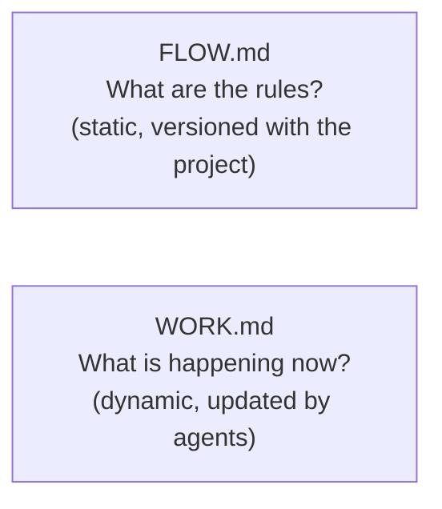

# Flow Protocol

This skill defines how to **design**, **create**, and **operate** a state machine workflow using two files:

- **`FLOW.md`** — the static state machine definition (never changes during execution)
- **`WORK.md`** — the dynamic work tracker (updated by agents at every state transition)

The project's current workflow is defined in the root `FLOW.md`. Load this skill when:
- Starting any session (to understand the operating protocol)
- Creating a new workflow from scratch
- Modifying an existing workflow

---

## Core Concepts

### State Machine Fundamentals

A finite state machine (FSM) consists of:

1. **States** — discrete stages a work item can be in (exactly one at a time)
2. **Transitions** — rules for moving from one state to another
3. **Guards** — conditions that must be true for a transition to fire
4. **Actions** — work performed while in a state or during a transition
5. **Owners** — the role responsible for executing a state

**Design principles** (from FSM theory and workflow management best practices):

- **Determinism**: given a state and a guard, exactly one transition fires — no ambiguity
- **Reachability**: every state must be reachable from the initial state
- **Termination**: every path must lead to a terminal state (or a defined cycle)
- **Single responsibility**: each state does one thing; transitions are cheap
- **WIP limits**: constrain how many items occupy a state simultaneously
- **Observable**: state must be detectable from the filesystem without reading WORK.md (self-healing)
- **Minimal variables**: track only what cannot be derived from other sources

### The Two-File Pattern



Agents read `FLOW.md` to know **what to do**. They read `WORK.md` to know **what is active and where it is**. They write only to `WORK.md` during normal operation.

### Work Variables

`FLOW.md` defines the minimal set of variables each work item must carry in `WORK.md`. Variables should satisfy:

- **Necessary**: removing it would make it impossible to resume work
- **Non-derivable**: cannot be computed from another variable or the filesystem
- **Role-agnostic**: not a property of a role (roles are derived from `@state` via FLOW.md)

Common variables (adapt to your workflow):

| Variable  | Type           | Description                                      |
|-----------|----------------|--------------------------------------------------|
| `@id`     | identifier     | Unique name of the work item                     |
| `@state`  | state name     | Current state in the workflow                    |
| `@branch` | git ref        | Where the work lives in version control          |

Add variables only when they cannot be derived. Example: `@owner` is unnecessary if each state in FLOW.md already declares its owner.

---

## Designing a Workflow

Follow these steps when creating a new `FLOW.md` from scratch or modifying an existing one.

### Step 1 — Identify the work item lifecycle

Answer these questions:
1. What is the unit of work? (feature, bug, PR, ticket…)
2. What are the discrete phases it passes through?
3. Who is responsible for each phase?
4. What signals the end of a phase? (filesystem artifact, test result, human approval…)
5. What can go wrong, and where does failure route?

### Step 2 — Define states

For each phase, write a state entry:
```
State name    — short, uppercase, unambiguous (e.g. STEP-3-RED)
Owner         — the role that executes this state
Entry guard   — detectable condition that confirms we are in this state
Action        — what the owner does
Exit          — what triggers the transition out
Failure route — where to go if the action cannot complete
```

**Smell check**:
- More than ~12 states → consider splitting into sub-workflows
- Any state with no exit → add a failure route
- Two states with the same entry guard → merge or sharpen guards

### Step 3 — Order the detection rules

States are detected **in order**. Write detection rules as an ordered list where:
- Earlier rules eliminate more states quickly (terminal/error states first)
- Each rule is a single, fast filesystem or git command
- No rule requires running tests (reserve that for later rules only)

This ordering is the FSM's auto-detection mechanism and makes WORK.md self-healing.

### Step 4 — Define work variables

List only the variables agents cannot derive. Reference them as `@variable` throughout FLOW.md. WORK.md entries must carry every variable in this list.

### Step 5 — Define roles

List each role with its agent file path. Every state owner must appear in this table. These are the prerequisites for running the workflow.

### Step 6 — Draw the transition diagram

Include a Mermaid `stateDiagram-v2`. It must show every state and every valid transition including failure routes. This is the primary human-readable artifact.

---

## Operating Protocol

### Session Start (all agents)

1. Read `FLOW.md` — understand the workflow rules
2. Read `WORK.md` — find the active item; note `@id`, `@state`, `@branch`
3. Run auto-detection commands from `FLOW.md` to verify `@state`
4. If detected state differs from `WORK.md`, update `WORK.md` to match reality (filesystem wins)
5. Check prerequisites from `FLOW.md` — if any missing, stop and report
6. Read the work item artifact (e.g. `.feature` file) for context
7. Verify git workspace matches `@branch`

### Session End (all agents)

1. Update `WORK.md`:
   - Set `@state` to the new state
2. Commit WORK.md update before any further work:
   ```bash
   git add WORK.md && git commit -m "chore: @id transition to @state"
   ```
3. Commit any remaining work as WIP if not fully complete:
   ```bash
   git add -A && git commit -m "WIP(@id): <what was done>"
   ```

### State Transition Rule

The agent who **completes** a state is responsible for updating `WORK.md` to the next state **before** doing any other work. Transitions are atomic: update WORK.md, commit, then proceed.

### Self-Healing Rule

If `WORK.md` and auto-detection disagree, the filesystem is the source of truth. Update `WORK.md` to match. Never "correct" the filesystem to match WORK.md.

---

## WORK.md Format

```markdown
# WORK — Active Work Tracking

This file tracks live work items. The workflow rules live in `FLOW.md`.

Each item carries exactly the variables defined by `FLOW.md`:
- @id — <description>
- @state — <description>
- @branch — <description>

---

## Active Items

- @id: <value>
  @state: <value>
  @branch: <value>

```

Multiple active items are allowed when the workflow permits parallel work. Each is a separate bullet entry under `## Active Items`.

---

## Creating a New Workflow

Use the templates bundled with this skill as starting points:

- `flow.md.template` — empty FLOW.md skeleton
- `work.md.template` — empty WORK.md skeleton

Steps:
1. Copy `flow.md.template` to your project root as `FLOW.md`
2. Copy `work.md.template` to your project root as `WORK.md`
3. Follow the design steps above to fill in `FLOW.md`
4. Define work variables and update the variable list in `WORK.md`
5. Verify the detection rules are ordered correctly
6. Verify all roles have agent files

---

## Rules

1. Never skip reading `FLOW.md` and `WORK.md` at session start
2. Never end a session without updating `WORK.md` and committing
3. Never commit directly to `main`
4. If `WORK.md` is missing, create it from `work.md.template` before any other work
5. If detected state differs from `WORK.md`, trust the filesystem and update `WORK.md`
6. One step per session where possible; do not start Step N+1 in the same session as Step N
