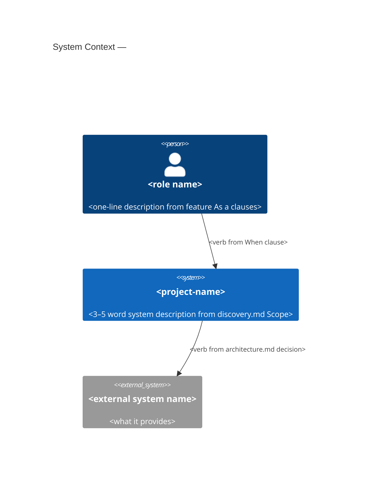
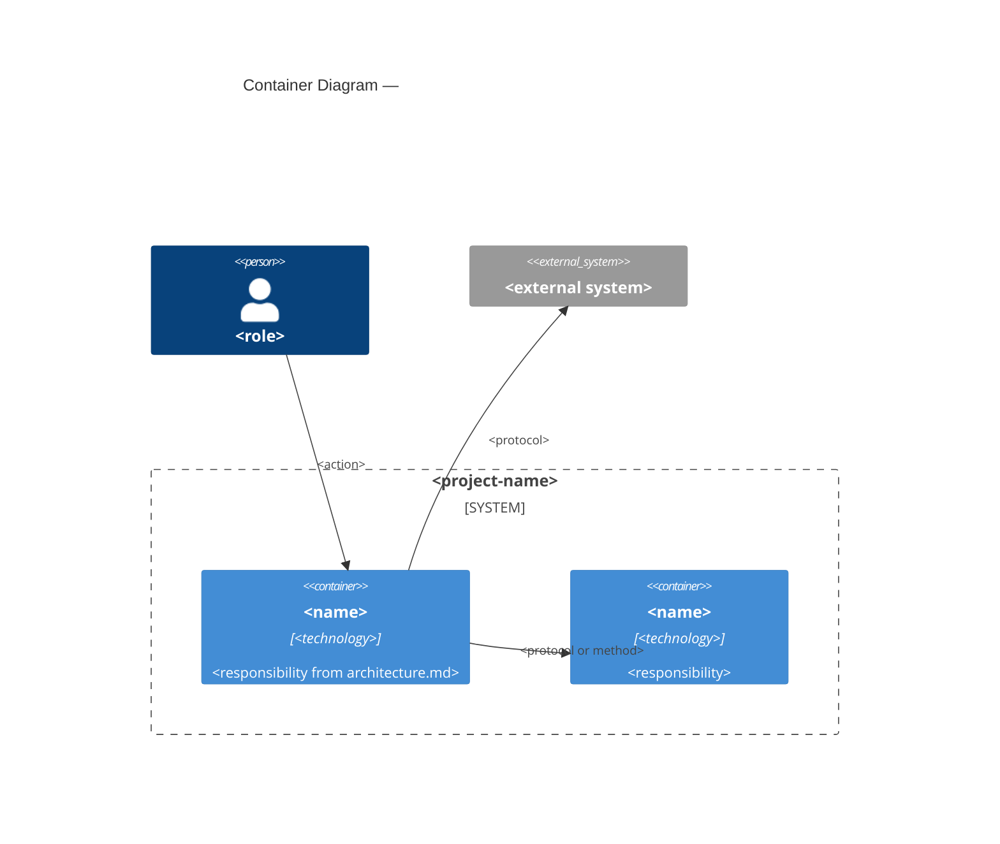

# Living Docs

This skill generates and updates two living documents after a feature is accepted (Step 5) or on stakeholder request: the **C4 architecture diagrams** and the **living glossary**. Both are derived from existing project documentation — no new decisions are made.

The glossary is a secondary artifact derived from the code, the domain model, and domain-expert conversations. The canonical sources are the completed feature files, the discovery synthesis, and the architectural decisions. The glossary is a human-readable projection of those sources — not an independent authority.

## When to Use

- **As part of the release process (Step 5)** — the `git-release` skill calls this skill inline at step 5, before the version-bump commit. Do not commit separately; the release process stages all files together.
- **Stakeholder on demand** — when the stakeholder asks "what does the system look like?" or "what does term X mean in this context?". In this case, commit with the standalone message in Step 5 below.

## Ownership Rules

| Document | Created/Updated by | Inputs read |
|---|---|---|
| `docs/c4/context.md` | `living-docs` skill (PO) | `docs/discovery.md`, `docs/features/completed/` |
| `docs/c4/container.md` | `living-docs` skill (PO) | `docs/architecture.md`, `docs/features/completed/` |
| `docs/glossary.md` | `living-docs` skill (PO) | `docs/discovery.md`, `docs/glossary.md` (existing), `docs/architecture.md`, `docs/features/completed/` |
| `docs/architecture.md` | SE only (Step 2) | — |
| `docs/discovery.md` | PO only (Step 1) | — |

**Never edit `docs/architecture.md` or `docs/discovery.md` in this skill.** Those files are append-only by their respective owners. This skill reads them; it never writes to them.

---

## Step 1 — Read Phase (all before writing anything)

Read in this order:

1. `docs/discovery.md` — project scope, domain model (nouns/verbs), feature list per session
2. `docs/features/completed/` — all completed `.feature` files (full text: Rules, Examples, Constraints)
3. `docs/architecture.md` — all architectural decisions (containers, modules, protocols, external deps)
4. `docs/c4/` — existing C4 diagrams if they exist (update, do not replace from scratch)
5. `docs/glossary.md` — existing glossary if it exists (extend, never remove existing entries)

Identify from the read phase:

- **Actors** — named human roles from feature `As a <role>` clauses and discovery Scope section
- **External systems** — any system outside the package boundary named in features or architecture decisions
- **Containers** — deployable/runnable units identified in `docs/architecture.md` (Hexagonal adapters, CLIs, services)
- **Key domain terms** — all nouns from `docs/discovery.md` Domain Model tables, plus any terms defined in `docs/architecture.md` decisions

---

## Step 2 — Update C4 Context Diagram (Level 1)

File: `docs/c4/context.md`

The Context diagram answers: **who uses the system and what external systems does it interact with?**

Use Mermaid `C4Context` syntax. Template:

```markdown
# C4 — System Context

> Last updated: YYYY-MM-DD
> Source: docs/discovery.md, docs/features/completed/


```

Rules:
- One `Person(...)` per distinct actor found in completed feature files
- One `System_Ext(...)` per external dependency identified in `docs/architecture.md` decisions
- Relationships (`Rel`) use verb phrases from feature `When` clauses or architecture decision labels
- If no external systems are identified in `docs/architecture.md`, omit `System_Ext` entries
- If the file already exists: update only — add new actors/systems, update relationship labels. Never remove an existing entry unless the feature it came from has been explicitly superseded

---

## Step 3 — Update C4 Container Diagram (Level 2)

File: `docs/c4/container.md`

The Container diagram answers: **what are the major runnable/deployable units and how do they communicate?**

Only generate this diagram if `docs/architecture.md` contains at least one decision identifying a distinct container boundary (e.g., a CLI entry point separate from a library, a web server, a background worker, an external service adapter). If the project is a single-container system, note this in the file and skip the diagram body.

Use Mermaid `C4Container` syntax. Template:

```markdown
# C4 — Container Diagram

> Last updated: YYYY-MM-DD
> Source: docs/architecture.md


```

Rules:
- Container names and responsibilities come directly from `docs/architecture.md` decisions — do not invent them
- Technology labels come from `pyproject.toml` dependencies when identifiable (e.g., "Python / fire CLI", "Python / FastAPI")
- If the file already exists: update incrementally — do not regenerate from scratch

---

## Step 4 — Update Living Glossary

File: `docs/glossary.md`

The glossary answers: **what does each domain term mean in this project's context?**

### Format

```markdown
# Glossary — <project-name>

> Living document. Updated after each completed feature by the `living-docs` skill.
> Source: docs/discovery.md (Domain Model), docs/features/completed/, docs/architecture.md

---

## <Term>

**Type:** Noun | Verb | Domain Event | Concept | Role | External System

**Definition:** <one sentence, plain English, no jargon>

**Bounded context:** <name of the bounded context where this term is defined; required when the project has more than one bounded context; omit only for single-context projects>

**First appeared:** <YYYY-MM-DD discovery session or feature name>

---
```

### Rules

- Extract all nouns and verbs from every `### Domain Model` table in `docs/discovery.md`
- Extract all roles from `As a <role>` clauses in completed `.feature` files
- Extract all external system names from `docs/architecture.md` decisions
- Extract any term defined or clarified in architectural decision `Reason:` fields
- **Do not remove existing glossary entries** — if a term's meaning has changed, add a `**Superseded by:**` line pointing to the new entry and write a new entry
- **Every term must have a traceable source** — completed feature files or `docs/architecture.md` decisions. If a term appears in sources but is never defined, write `Definition: Term appears in [source] but has not been explicitly defined.` Do not invent a definition.
- Terms are sorted alphabetically within the file

### Merge with existing glossary

If `docs/glossary.md` already exists:
1. Read all existing entries
2. For each new term found in sources: check if it already exists in the glossary
   - Exists, definition unchanged → skip
   - Exists, definition changed → append `**Superseded by:** <new-term-or-date>` to old entry; write new entry
   - Does not exist → append new entry in alphabetical order

---

## Step 5 — Commit

**When called from the release process**: skip this step — the `git-release` skill stages and commits all files together.

**When run standalone** (stakeholder on demand): commit after all diagrams and glossary are updated:

```
docs(living-docs): update C4 and glossary after <feature-stem>
```

If triggered without a specific feature (general refresh):

```
docs(living-docs): refresh C4 diagrams and glossary
```

---

## Checklist

- [ ] Read all five source files before writing anything
- [ ] Context diagram reflects all actors from completed feature files
- [ ] Context diagram reflects all external systems from `docs/architecture.md`
- [ ] Container diagram present only if multi-container architecture confirmed in `docs/architecture.md`
- [ ] Glossary contains all nouns and verbs from `docs/discovery.md` Domain Model tables
- [ ] No existing glossary entry removed
- [ ] Every new term has a traceable source in completed feature files or `docs/architecture.md`; no term is invented
- [ ] No edits made to `docs/architecture.md` or `docs/discovery.md`
- [ ] If standalone: committed with `docs(living-docs): ...` message
- [ ] If called from release: files staged but not committed (release process commits)
