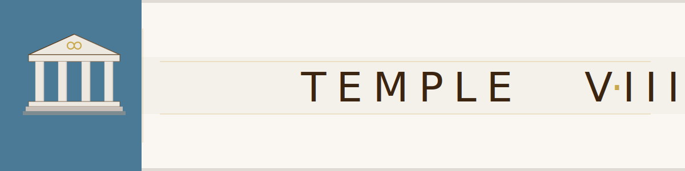

<div align="center">



<br/><br/>

[![Contributors][contributors-shield]][contributors-url]
[![Forks][forks-shield]][forks-url]
[![Stargazers][stars-shield]][stars-url]
[![Issues][issues-shield]][issues-url]
[![MIT License][license-shield]][license-url]
[](https://nullhack.github.io/python-project-template/coverage/)
[](https://github.com/nullhack/python-project-template/actions/workflows/ci.yml)
[](https://www.python.org/downloads/)

**From zero to hero — production-ready Python, without the ceremony.**

</div>

---

## Quick Start

```bash
git clone https://github.com/nullhack/python-project-template
cd python-project-template
curl -LsSf https://astral.sh/uv/install.sh | sh  # skip if uv installed
uv sync --all-extras
opencode && @setup-project                        # personalise for your project
uv run task test && uv run task lint && uv run task static-check
```

---

## Why this template?

Most Python templates give you a folder structure and a `Makefile`. This one gives you a **complete delivery system**: five AI agents, a structured five-step workflow, and quality gates that cannot be silenced by convention.

The goal is to give every project — from its first commit — the same rigour that mature teams take years to establish.

- **No feature starts without written acceptance criteria** — Gherkin `Example:` blocks traced to tests
- **No feature ships without adversarial review** — the system-architect's default hypothesis is "broken"
- **No guesswork on test stubs** — generated automatically from `.feature` files
- **No manual `@id` tags** — assigned automatically when you run tests
- **No ambiguity on workflow state** — `FLOW.md` auto-detects current step from filesystem and git state
- **AI agents for every role** — each agent has scoped instructions and cannot exceed its authority

---

## How it works

### The delivery cycle

```
SCOPE → ARCH → TDD LOOP → VERIFY → ACCEPT
```

| Step | Role | Output |
|------|------|--------|
| **1 · SCOPE** | Product Owner | Discovery interviews + Gherkin stories + acceptance criteria |
| **2 · ARCH** | System Architect | Module stubs, ADRs, auto-generated test stubs |
| **3 · TDD LOOP** | Software Engineer | RED → GREEN → REFACTOR, one criterion at a time |
| **4 · VERIFY** | System Architect | Adversarial check — lint, types, coverage, semantic review |
| **5 · ACCEPT** | Product Owner | Demo, validate, ship |

**WIP limit: 1 feature at a time.** Features are `.feature` files that move through folders:

```
docs/features/backlog/      ← waiting
docs/features/in-progress/  ← building (max 1)
docs/features/completed/    ← shipped
```

### AI agents included

| Agent | Responsibility |
|-------|---------------|
| `@product-owner` | Scope, stories, acceptance criteria, delivery acceptance |
| `@software-engineer` | TDD loop, implementation, git, releases |
| `@system-architect` | Adversarial verification — default position: broken |
| `@designer` | Visual identity, colour palette, SVG assets |
| `@setup-project` | One-time project initialisation |

### Quality tooling, pre-configured

| Tool | Role |
|------|------|
| `uv` | Package & environment management |
| `ruff` | Lint + format (Google docstrings) |
| `pyright` | Static type checking — 0 errors |
| `pytest` + `hypothesis` | Tests + property-based testing |
| `pytest-beehave` | Auto-generates test stubs from `.feature` files |
| `pytest-cov` | Coverage — 100% required |
| `pdoc` | API docs → GitHub Pages |
| `taskipy` | Task runner |

---

## Commands

```bash
uv run task test          # Full suite + coverage
uv run task test-fast     # Fast, no coverage (use during TDD loop)
uv run task lint          # ruff check + format
uv run task static-check  # pyright
uv run task run           # Run the app
```

---

## Code standards

| | |
|---|---|
| Coverage | 100% |
| Type errors | 0 |
| Function length | ≤ 20 lines |
| Class length | ≤ 50 lines |
| Max nesting | 2 levels |
| Principles | YAGNI › KISS › DRY › SOLID › Object Calisthenics |

---

## Test convention

Write acceptance criteria in Gherkin:

```gherkin
@id:a3f2b1c4
Example: User sees version on startup
  Given the application starts
  When no arguments are passed
  Then the version string is printed to stdout
```

Run tests once — a traced, skipped stub appears automatically:

```python
@pytest.mark.skip(reason="not yet implemented")
def test_display_version_a3f2b1c4() -> None:
    """
    Given the application starts
    When no arguments are passed
    Then the version string is printed to stdout
    """
```

Each test traces to exactly one acceptance criterion. No orphan tests. No untested criteria.

---

## Branding

When you run `@setup-project`, the agent collects your project's identity — name, tagline, mission, colour palette, and release naming convention — and writes `docs/branding.md`. All agents read this file. Release names, C4 diagram colours, and generated copy all reflect your project's identity without you touching `.opencode/`.

Absent or blank fields fall back to defaults: adjective-animal release names, Mermaid default colours, no wording constraints.

---

## Versioning

`v{major}.{minor}.{YYYYMMDD}` — each release gets a unique name derived from your branding convention. By default: an adjective paired with an animal (scientific name). Configure your own theme in `docs/branding.md`.

---

## License

MIT — see [LICENSE](LICENSE).

**Author:** [@nullhack](https://github.com/nullhack) · [Documentation](https://nullhack.github.io/python-project-template)

<!-- MARKDOWN LINKS -->
[contributors-shield]: https://img.shields.io/github/contributors/nullhack/python-project-template.svg?style=for-the-badge
[contributors-url]: https://github.com/nullhack/python-project-template/graphs/contributors
[forks-shield]: https://img.shields.io/github/forks/nullhack/python-project-template.svg?style=for-the-badge
[forks-url]: https://github.com/nullhack/python-project-template/network/members
[stars-shield]: https://img.shields.io/github/stars/nullhack/python-project-template.svg?style=for-the-badge
[stars-url]: https://github.com/nullhack/python-project-template/stargazers
[issues-shield]: https://img.shields.io/github/issues/nullhack/python-project-template.svg?style=for-the-badge
[issues-url]: https://github.com/nullhack/python-project-template/issues
[license-shield]: https://img.shields.io/badge/license-MIT-green?style=for-the-badge
[license-url]: https://github.com/nullhack/python-project-template/blob/main/LICENSE
