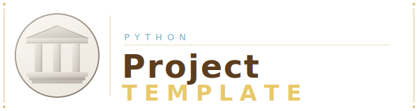

<div align="center">



<br/>

[![Contributors][contributors-shield]][contributors-url]
[![Forks][forks-shield]][forks-url]
[![Stargazers][stars-shield]][stars-url]
[![Issues][issues-shield]][issues-url]
[![MIT License][license-shield]][license-url]
[](https://nullhack.github.io/python-project-template/coverage/)
[](https://github.com/nullhack/python-project-template/actions/workflows/ci.yml)
[](https://www.python.org/downloads/)

**Production-ready Python scaffolding with a structured AI-agent workflow — from idea to shipped feature.**

</div>

---

## Quick Start

```bash
git clone https://github.com/nullhack/python-project-template
cd python-project-template
curl -LsSf https://astral.sh/uv/install.sh | sh  # skip if uv installed
uv sync --all-extras
opencode && @setup-project                        # personalise for your project
uv run task test && uv run task lint && uv run task static-check
```

---

## What You Get

### A structured 5-step development cycle

```
SCOPE → ARCH → TDD LOOP → VERIFY → ACCEPT
```

| Step | Who | What |
|------|-----|------|
| **SCOPE** | Product Owner | Discovery interviews → Gherkin stories → `@id` criteria |
| **ARCH** | Software Engineer | Module design, ADRs, test stubs |
| **TDD LOOP** | Software Engineer | RED → GREEN → REFACTOR, one `@id` at a time |
| **VERIFY** | Reviewer | Adversarial verification — default hypothesis: broken |
| **ACCEPT** | Product Owner | Demo, validate, ship |

WIP limit of 1. Features are `.feature` files that move between filesystem folders:

```
docs/features/backlog/      ← waiting
docs/features/in-progress/  ← building (max 1)
docs/features/completed/    ← shipped
```

### AI agents included

```
@product-owner      — scope, stories, acceptance
@software-engineer  — architecture, TDD, git, releases
@reviewer           — adversarial verification
@setup-project      — one-time project initialisation
```

### Quality tooling, pre-configured

| Tool | Role |
|------|------|
| `uv` | Package & environment management |
| `ruff` | Lint + format (Google docstrings) |
| `pyright` | Static type checking — 0 errors |
| `pytest` + `hypothesis` | Tests + property-based testing |
| `pytest-cov` | Coverage — 100% required |
| `pdoc` | API docs → GitHub Pages |
| `taskipy` | Task runner |

---

## Commands

```bash
uv run task test          # Full suite + coverage
uv run task test-fast     # Fast, no coverage (use during TDD loop)
uv run task lint          # ruff check + format
uv run task static-check  # pyright
uv run task run           # Run the app
```

---

## Code Standards

| | |
|---|---|
| Coverage | 100% |
| Type errors | 0 |
| Function length | ≤ 20 lines |
| Class length | ≤ 50 lines |
| Max nesting | 2 levels |
| Principles | YAGNI › KISS › DRY › SOLID › Object Calisthenics |

---

## Test Convention

```python
@pytest.mark.skip(reason="not yet implemented")
def test_feature_a3f2b1c4() -> None:
    """
    Given: ...
    When:  ...
    Then:  ...
    """
```

Each test is traced to exactly one `@id` acceptance criterion.

---

## Versioning

`v{major}.{minor}.{YYYYMMDD}` — each release gets a unique adjective-animal name.

---

## License

MIT — see [LICENSE](LICENSE).

**Author:** [@nullhack](https://github.com/nullhack) · [Documentation](https://nullhack.github.io/python-project-template)

<!-- MARKDOWN LINKS -->
[contributors-shield]: https://img.shields.io/github/contributors/nullhack/python-project-template.svg?style=for-the-badge
[contributors-url]: https://github.com/nullhack/python-project-template/graphs/contributors
[forks-shield]: https://img.shields.io/github/forks/nullhack/python-project-template.svg?style=for-the-badge
[forks-url]: https://github.com/nullhack/python-project-template/network/members
[stars-shield]: https://img.shields.io/github/stars/nullhack/python-project-template.svg?style=for-the-badge
[stars-url]: https://github.com/nullhack/python-project-template/stargazers
[issues-shield]: https://img.shields.io/github/issues/nullhack/python-project-template.svg?style=for-the-badge
[issues-url]: https://github.com/nullhack/python-project-template/issues
[license-shield]: https://img.shields.io/badge/license-MIT-green?style=for-the-badge
[license-url]: https://github.com/nullhack/python-project-template/blob/main/LICENSE
