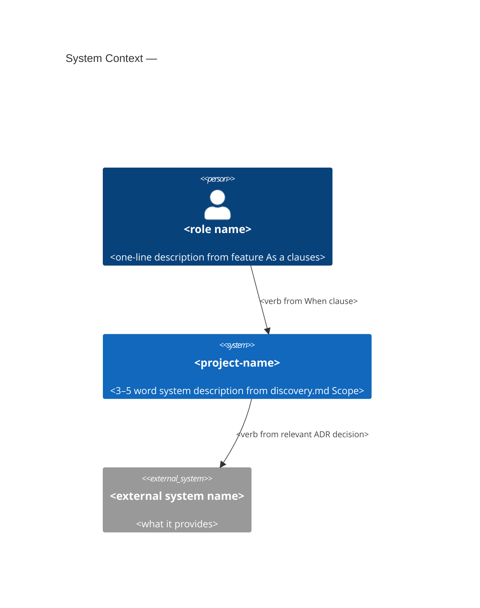

# C4 — System Context

> Last updated: YYYY-MM-DD
> Source: docs/domain-model.md, docs/glossary.md, docs/features/completed/

```mermaid
C4Context
  title System Context — <project-name>

  Person(actor1, "<role name>", "<one-line description from feature As a clauses>")

  System(system, "<project-name>", "<3–5 word system description from discovery.md Scope>")

  System_Ext(ext1, "<external system name>", "<what it provides>")

  Rel(actor1, system, "<verb from When clause>")
  Rel(system, ext1, "<verb from relevant ADR decision>")
```
