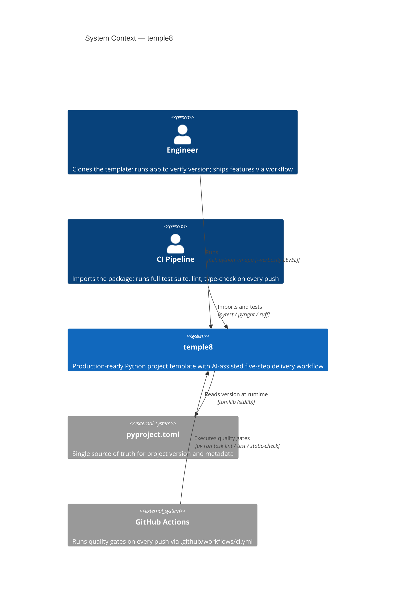
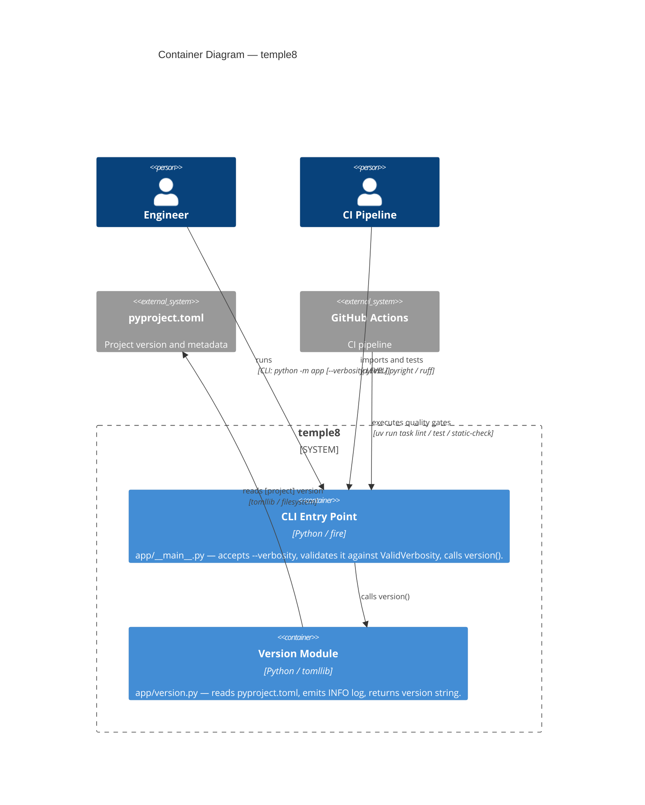

# System Overview: temple8

> Last updated: 2026-04-22 — display-version

**Purpose:** Provide a production-ready Python project template that eliminates setup boilerplate so engineers can ship features immediately.

---

## Summary

temple8 is a Python project template. Engineers clone it and run a five-step AI-assisted delivery workflow — Scope → Arch → TDD Loop → Verify → Accept — to ship features with quality gates from day one. The template ships with one working demonstration feature (`display-version`) that exercises the full stack end-to-end: it reads the application version from `pyproject.toml` at runtime via `tomllib`, logs it at INFO level, and gates visibility on a `ValidVerbosity` parameter. Quality tooling (ruff, pyright, pytest, hypothesis) and CI are preconfigured; no setup required beyond cloning.

---

## Actors

| Actor | Needs |
|-------|-------|
| Engineer | Clones the template; runs `python -m app` to verify the installed version and control log verbosity; ships features using the built-in workflow |
| CI Pipeline | Imports the package; runs the full test suite, lint, and type-check on every push |

---

## Structure

| Module | Responsibility |
|--------|----------------|
| `app/__main__.py` | CLI entry point; accepts `--verbosity` flag; validates it and delegates to `version()` |
| `app/version.py` | Reads `pyproject.toml` via `tomllib`; logs and returns the version string |

---

## Key Decisions

- Version is read from `pyproject.toml` at runtime via `tomllib`; no hardcoded `__version__` constant. (see `ADR-2026-04-22-version-source`)
- Log verbosity is validated against the five standard Python log levels before use; invalid values raise `ValueError`. (see `ADR-2026-04-22-verbosity-validation`)

---

## External Dependencies

| Dependency | What it provides | Why not replaced |
|------------|------------------|-----------------|
| `fire` | CLI argument parsing from function signatures | Zero boilerplate; consistent with template philosophy |
| `tomllib` (stdlib, Python ≥ 3.11) | TOML parsing for `pyproject.toml` | Standard library; no extra dependency needed |

---

## Active Constraints

- `pyproject.toml` is the single source of truth for the version string; never duplicate it.
- `main()` must accept `verbosity` as its only parameter; no global state.
- All new modules must achieve 100% test coverage before merging.

---

## Domain Model

### Bounded Contexts

| Context | Responsibility | Key Modules |
|---------|----------------|-------------|
| **Version** | Read the project version and emit a log message | `app/version.py` |
| **CLI** | Parse CLI arguments; validate verbosity; compose entry point | `app/__main__.py` |

### Entities

| Name | Type | Description | Bounded Context |
|------|------|-------------|-----------------|
| `Version` | Value Object | The semver string (`MAJOR.MINOR.YYYYMMDD`) read from `pyproject.toml` at runtime via `tomllib`. Never duplicated as a source-code constant. | Version |
| `ValidVerbosity` | Value Object | A string drawn from the closed set `{DEBUG, INFO, WARNING, ERROR, CRITICAL}`. Any other value is invalid and raises `ValueError`. | CLI |

### Actions

| Name | Actor | Object | Description |
|------|-------|--------|-------------|
| `version()` | version module | `pyproject.toml` → `Version` | Reads `pyproject.toml`, emits an INFO log in the format `"Version: <version>"`, and returns the version string |
| `main(verbosity)` | CLI entry point | `ValidVerbosity` → None | Validates verbosity, configures the root logger, then calls `version()`. Raises `ValueError` on invalid verbosity |

### Relationships

| Subject | Relation | Object | Cardinality | Notes |
|---------|----------|--------|-------------|-------|
| `main()` | validates-and-calls | `version()` | 1:1 | Verbosity guard runs before version read |
| `version()` | reads | `pyproject.toml` | 1:1 | Single file read per call; no caching |
| `ValidVerbosity` | constrains | `main()` | 1:1 | Only valid level names accepted |

---

## Context

---

## Container

---

## ADR Index

| ADR | Decision |
|-----|----------|
| [ADR-2026-04-22-version-source](adr/ADR-2026-04-22-version-source.md) | Read version from `pyproject.toml` via `tomllib` at runtime; no hardcoded constant |
| [ADR-2026-04-22-verbosity-validation](adr/ADR-2026-04-22-verbosity-validation.md) | Validate verbosity against a closed set; raise `ValueError` on invalid input |

---

## Completed Features

| Feature | Description |
|---------|-------------|
| `display-version` | Reads version from `pyproject.toml` at runtime and logs it; verbosity controls log visibility |
