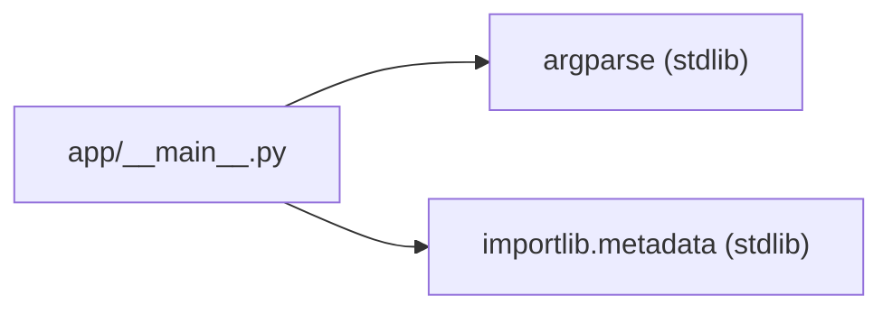
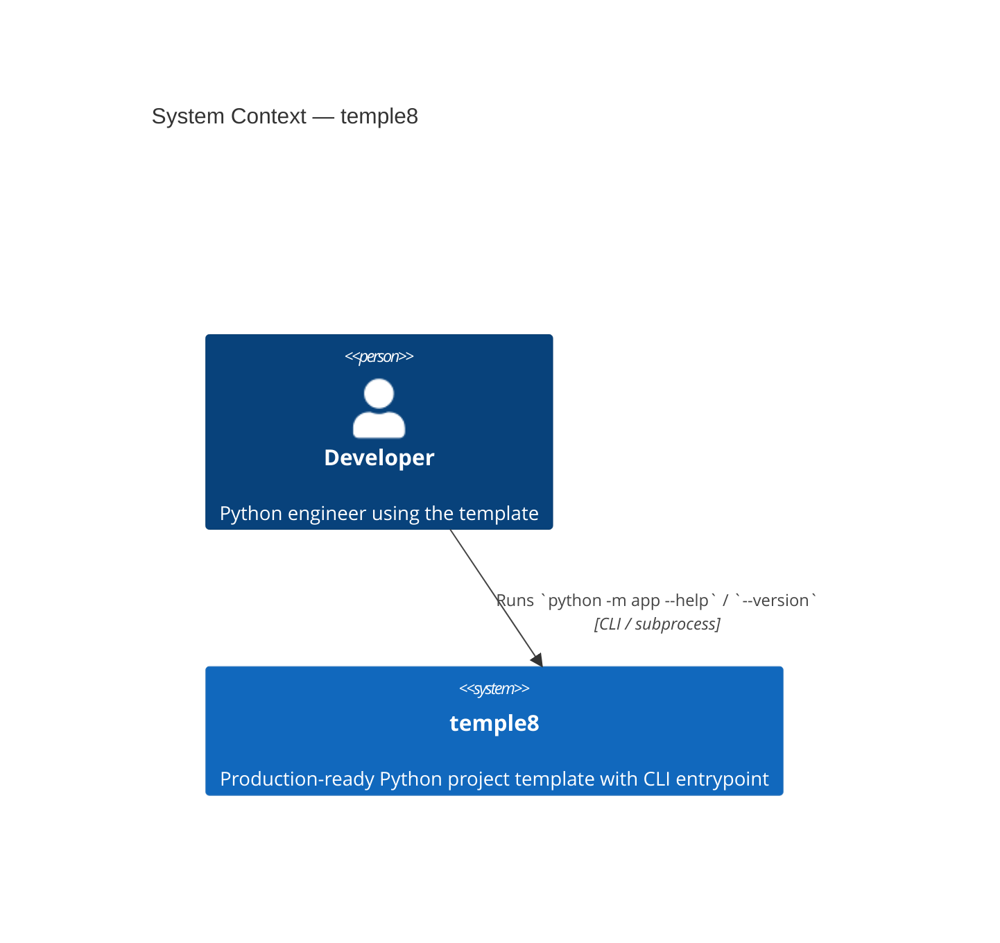
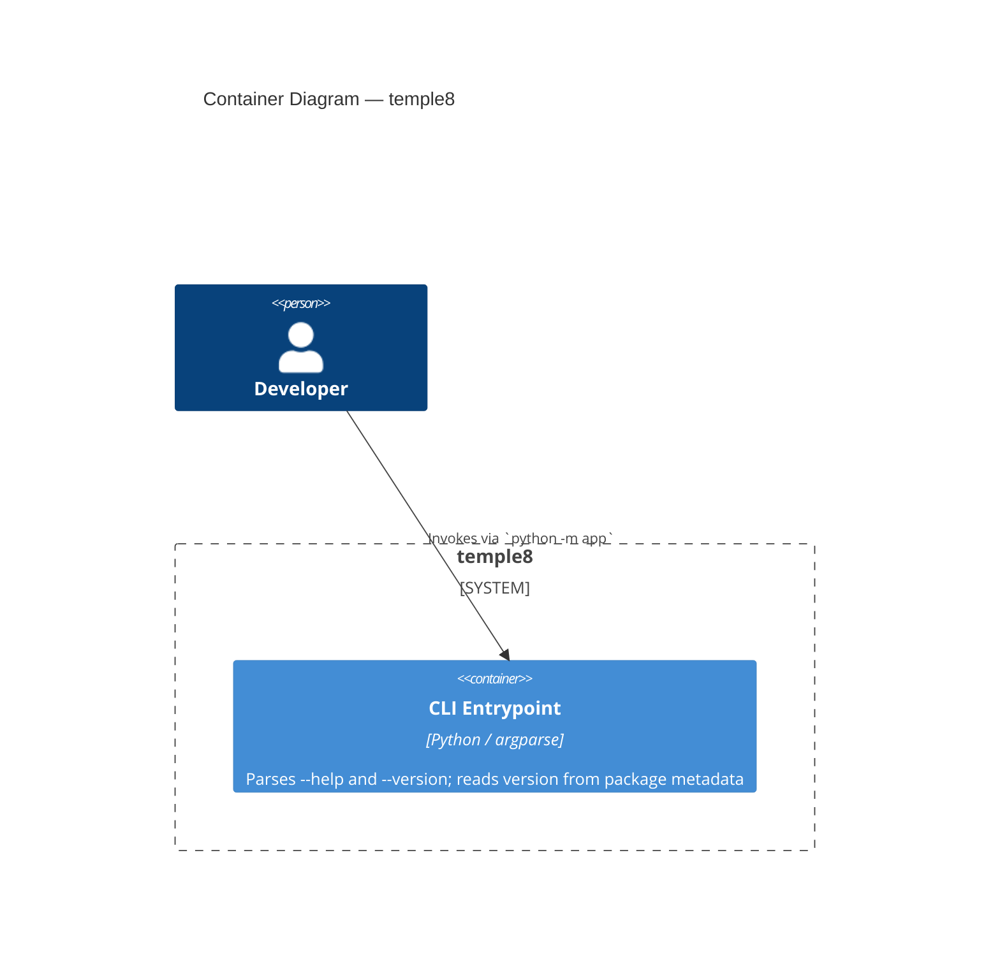

# System Overview: temple8

> Current-state description of the production system.
> Rewritten by the system-architect at Step 2 for each feature cycle.
> Reviewed by the product-owner at Step 5.
> Contains only completed features — nothing from backlog or in-progress.

---

## Summary

temple8 is a Python project template that gives engineers a production-ready skeleton with zero
boilerplate. It ships with a single demonstration feature — a CLI entrypoint (`python -m app`) —
that exercises the full five-step delivery workflow end-to-end. The system is a single Python
package (`app`) with no runtime dependencies beyond the Python stdlib.

---

## Actors

| Actor | Needs |
|-------|-------|
| `Developer` | Run `python -m app --help` to verify the CLI is wired up; run `--version` to confirm the installed package version |

---

## Structure

| Module | Responsibility |
|--------|----------------|
| `app/__main__.py` | CLI entrypoint: parses `--help` and `--version` flags; reads version from package metadata |
| `app/__init__.py` | Package marker; no public API |

---

## Key Decisions

- Use `argparse` (stdlib) for CLI parsing — zero new dependencies (ADR-2026-04-22-cli-parser-library)
- Read version from `importlib.metadata` at runtime — single source of truth, never hardcoded (ADR-2026-04-22-version-source)

---

## Configuration Keys

| Key | Type | Default | Description |
|-----|------|---------|-------------|
| `project.name` | string | `"temple8"` | Application name; read from installed package metadata |
| `project.description` | string | `"From zero to hero — production-ready Python, without the ceremony."` | Tagline; set as `argparse` description |
| `project.version` | string | `"7.1.20260422"` | Calver version; read at runtime via `importlib.metadata` |

---

## External Dependencies

| Dependency | What it provides | Why not replaced |
|------------|------------------|-----------------|
| `argparse` | CLI argument parsing | stdlib; zero install cost; sufficient for 2-flag skeleton |
| `importlib.metadata` | Runtime package metadata access | stdlib; canonical API since Python 3.8 |

---

## Active Constraints

- Zero new runtime dependencies — all CLI and metadata functionality uses Python stdlib only
- All production code lives in `app/__main__.py` — no new source files
- Version format is calver (`major.minor.YYYYMMDD`); tests must not assume semver

---

## Domain Model

### Bounded Contexts

| Context | Responsibility | Key Modules |
|---------|----------------|-------------|
| `CLI` | Expose the application as a command-line tool; parse flags; print help and version | `app/__main__.py` |

### Entities

| Name | Type | Description | Bounded Context |
|------|------|-------------|-----------------|
| `ArgumentParser` | Value Object (stdlib) | Configured parser with `--help` and `--version` actions | `CLI` |

### Actions

| Name | Actor | Object | Description |
|------|-------|--------|-------------|
| `build_parser` | `__main__` module | → `argparse.ArgumentParser` | Constructs and returns the configured CLI parser |
| `main` | `__main__` module | `sys.argv` → exit | Parses arguments and dispatches; `argparse` handles exit codes natively |

### Relationships

| Subject | Relation | Object | Cardinality | Notes |
|---------|----------|--------|-------------|-------|
| `main` | calls | `build_parser` | 1:1 | Parser constructed fresh on each invocation |
| `build_parser` | reads | `importlib.metadata` | 1:1 | Version string fetched at parser construction time |

### Module Dependency Graph

---

## Context

---

## Container

---

## ADRs

See `docs/adr/` for the full decision record. Each ADR contains a `## Context` section with the Q&A that produced the decision.

| ADR | Decision |
|-----|----------|
| `ADR-2026-04-22-cli-parser-library` | Use `argparse` (stdlib) for CLI parsing — zero new dependencies |
| `ADR-2026-04-22-version-source` | Read version from `importlib.metadata` at runtime — never hardcoded |

---

## Completed Features

*(none yet — cli-entrypoint is in-progress)*
